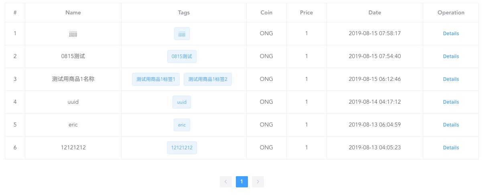

# Solution for marketplace


联系资源提供者和资源需求者的纽带，存储资源的元信息，为资源提供灵活的展示和快捷的搜索，收取交易费用。每个交易市场可以按照自身交易的特性提供伸缩化的灵活服务，比如提供元信息模板、解决链下纠纷的电子合同模板等供交易双方具现化 后使用。MP 一般拥有资源交易定价体系。另外，MP 一般也拥有资源交易信息披露体系，可以对公众或者监管部门进行交易信息披露。


### 数据存储（可选）

Marketplace 提供两种存储方案，平台方亦可外接自己的存储方案

- [中心化存储方案]()

- [云存储]()

  中心化存储所有的数据，所有的操作通过中心化的过程来进行（不推荐）

  中心化存储会保存一个数据的描述，具体的数据会存储到云端，需要用时，会根据中心化存储的一个标识符去云端拿到具体的数据再给到平台方（推荐）


### 数据搜索展示（可选）

平台方选择marketplace存储方案后，可根据提供的 API 接口进行数据的查询和展示，需求方、提供方就可看到自己所需数据及上传的数据情况。

```javascript
UI界面类需自行开发设计
```


[具体 API ]()




### 交易

1. 提供方

- 为数据生成DataId, 传递 MP 所需参数，MP 会进行数据对齐，并调用 DataId 合约
- 为数据生成Token 并绑定DataId , 传递 MP 所需参数，MP 会根据 DToken 合约进行数据通证化
- 填写上传数据所需的最后参数并传递 MP，MP 会执行 Marketplace合约进行上传操作
- 挑战期过后，可通过 MP 调用 marketplace 合约进行 收款操作


2. 需求方

- 若数据通过MP提供的存储方案进行存储，可通过MP 提供 API 查询数据，进行购买操作，传递购买所需的参数，通过 MP 调用 marketplace 合约进行上链，提供方支付手续费给平台方（预设参数），并支付押金到合约，交易完成会返还押金。
- 可凭借已有Token并传递 查看数据所需的 MP 参数，MP 会调用 DToken 合约进行验证
- 若数据不符，传递MP所需申请仲裁的参数，MP 调用 仲裁合约进行仲裁
- 若数据符合，传递MP所需确认收货的参数，MP 调用marketplace 合约进行收货操作


3. 认证方

- 传递MP所需认证的参数，MP会进行认证操作


4. 仲裁方

- 传递MP所需仲裁数据，MP会根据仲裁约合规则判定的结果，分配资金给需求方、提供方


### 合约

- [DataId contract]()
- [DToken contract]()
- [Marketplace contract]()
- [Arbitration contract]()


