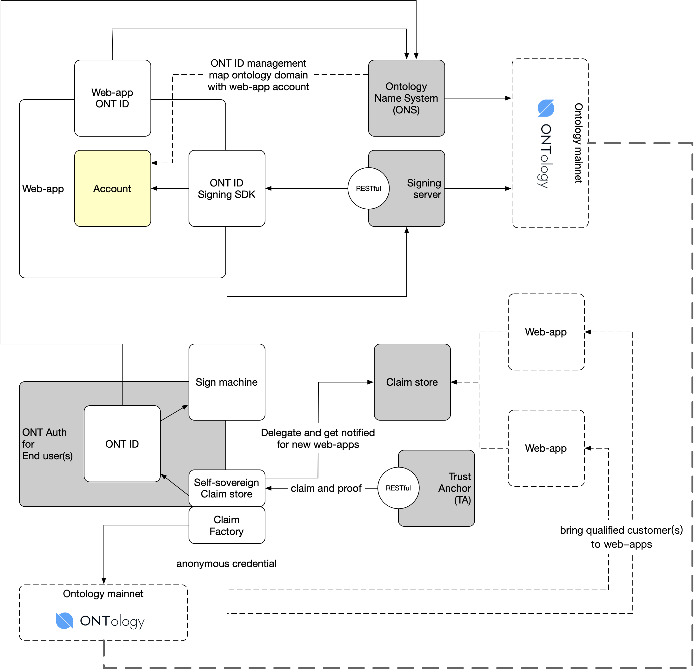
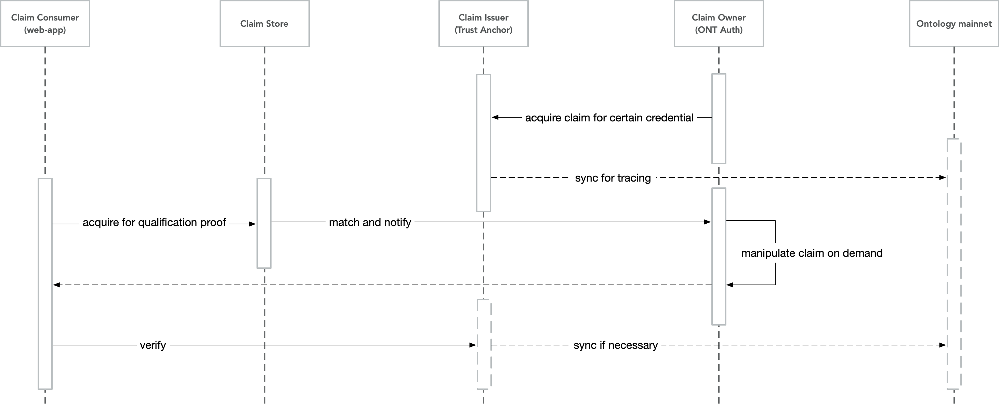

# Ontology Distributed Identity Framework (ONT ID)

Ontology DID (AKA: ONT ID) is a decentralized identification protocol which based on W3C DID specifications. It supports collaborative services such as distributed and diversified ownership confirmation, identification, and authentication of various entities including individuals, legal entities, objects, and contents. ONT ID establishes a cryptographically-based digital identity for each entity, allowing self-sovereign of data authorization and ownership confirmation, which makes the identity and data truly assets that the user can control. ONT ID has the characteristics of decentralization, self-management, privacy protection, security and ease of use.

Ontology establishes a decentralized trust model and distributed trust delivery system through ONT ID and verifiable claim, and uses the C-L signature algorithm and zero-knowledge proof protocol to assure privacy protection of verifiable claim. Through ONT ID, Ontology will also incorporate various authentication service agencies, and establish multi-source authentication of the entity’s identity to achieve complete identity portrait.

In addition to relying on specific central entities to build trust relationships, entities can also build equally strong trust relationships by themselves. Trust transfer is achieved through mutual authentication between entities. Entities will have higher credibility if they receive more authentications from other entities – especially if those other entities have high credibility.

## Components of ONT ID framework

ONT ID framework is targeting to provide 
1. self-sovereign identity for web applications, to buy in end user(s) of web-apps as stakeholder(s), and,
2. a platform to match the targeting user(s) for web-app(s) via a collection of third party claims, which results as the trust mechanism of Ontology.

### 1. Self-sovereign identity

In Ontology `ONT ID framework`, "entity" refers to individuals, legal entities (organizations, enterprises, institutions, etc.), objects (mobile phones, automobiles, IoT devices, etc.), and contents (articles, copyrights, etc.) in the real world, and "identity" refers to the entity's identity within the network. 

1. **ONT ID** `ONT ID(s)` are identifier(s) of ONT ID framework. All entities in Ontology system shall have an `ONT ID`. Ontology uses Ontology Identifier (`ONT ID`) to identify and manage the entities' identities. On Ontology blockchain, one entity can correspond to multiple individual identities, and there is no relation between multiple identities. [>> Learn more](./spec/ontid.md)
2. **ONT Auth** and **Signing server** `ONT ID` services are deployed to Ontology mainnet. Users own `ONT IDs`. To make full use of `ONT ID`, a mobile application `ONT Auth` is used to enable self-sovereign identity. A `signing server` is a server side service to bridge `ONT ID` from end user to account system inside web-app. 
  - [>> Learn more about `signing server`](./signing-server/README.md)
  - [>> Learn more about `ONT Auth`](./ont-auth/guide/README.md)
3. **Ontology Name System** [>> Learn more](./ons/README.md)

### 2. Ontology trust mechanism (the claim system)

Entities issue claims and "sell" them to their customers, where there are verification scenarios. The close loop of issuing request, creation and consuming of claims setup the Ontology trust mechanim.

- **Claim owner** Owner of an ONT ID. The entity acquires a verifiable claim issued by `claim issuer`. The entity is able to manipulate claims, with [`anonymous credential`](./claim-store/anonymous-credential.md) technology, and provide the credential to `claim consumer`. This role is the "`trust seller`".
- **Claim Issuer** Owner of an ONT ID. The entity is to issue claim to provide endorsement of target entity for certain qualifications or credentials. "`Claim Issuer`" includes a `trust anchor` (the partner that provides authentication services in Ontology ecosystem), could be government agencies, universities, banks, third-party authentication service agencies, biometric technology companies, etc. `Claim issuer` provides multi-dimensional authentication for entities, its authentication behavior and result will be record to Ontology blockchain with data privacy protection. `Claim issuer` provides a standardized and credible authentication method for `claim consumers` to verify the claims. This role is the "`trust endorser`".
- **Claim Consumer** "`Claim Consumer`" accepts the user's verifiable claim and have the claim verified. The verification covers many useful scenarios, e.g., the employers who need to verify the interviewer's identity information/degree/industry skills. This role is the "`trust buyer`".

The following diagram demostrates the claim sytem workflow, for detail, please view the [claim specification](./spec/claim.md).

To active the mechanism, the following components are setup in `ONT ID framework`.

1. **Trust anchor** Trust anchor refers to the partner that provides authentication services on the Ontology ecosystem. It may be government agencies, universities, banks, third-party authentication service agencies (such as CA agencies), biometric technology companies, etc. [>> Learn more](./turst-anchor/README.md)
   - **Verifiable Claim Protocol** A statement to confirm a claim made by one entity about another (including themselves). The claim is accompanied by a digital signature that can be used by other entities for authentication. The verifiable claim protocol describes in detail the procedures and specifications about issue, store, and verification of verifiable claim. [>> Learn more](./spec/claim.md)
2. **Claim store** A `claim store` is an entity to provide service for "`claim owners`" to manage their claims online, notify `claim owner(s)` when there is `claim consumer` for certain credentials. A `claim store` is usually an entity with NDA to ensure data privacy. [>> Learn more](./claim-store/README.md)
3. **ONT Auth** `ONT Auth` is a mobile application to manage personal claims. [>> Learn more](./ont-auth/guide/README.md)

## Scenarios of ONT ID framework

ONT ID framework covers the scenarios of most features in the account system of centralized web-app. The framework also covers the scenarios to bring qualified entity(ies) to their potential qualification consumer(s), esp., KYC (know your customer) in financial services.

- [>> Learn more](../business/scenarios/README.md)

## Business solutions using ONT ID

With ONT ID framework, solutions are ready for different domains.

- [>> Learn more](../business/solutions/README.md)